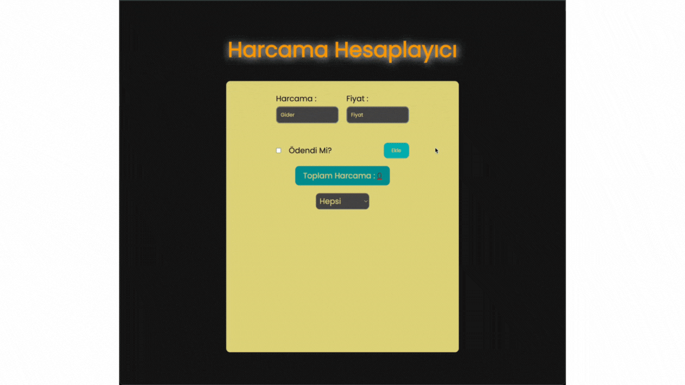

## Günlük Gider Takip Uygulaması

# Bu proje, JavaScript, HTML ve CSS kullanılarak geliştirilmiş bir günlük gider takip uygulamasıdır.

# Kullanılan Diller ve Teknolojiler
-JavaScript
-HTML
-CSS

#Özellikler
Kullanıcılar harcama adı ve tutarını girebilir.
Harcamalar listelenir ve ödeme durumuna göre filtrelenir.
Toplam harcama miktarı otomatik olarak güncellenir.
Kullanıcılar istedikleri zaman harcamaları silebilir.

# gif

# calculator
